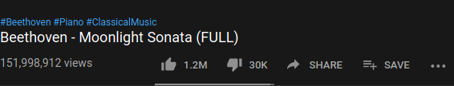

# youtube-publication-date

Sometimes publication date on YouTube is hidden.
This addon appends publication date to video title, so its always visible.

## Build and install

Run `./build.sh`. It will create .xpi file. Then go to `about:debugging` → `This Firefox` → `Load Temporary Add-on...` and select .xpi file.

## Try it without installing
`npm install`

`npm start`

## Screenshots
without addon   
  
with addon installed   

